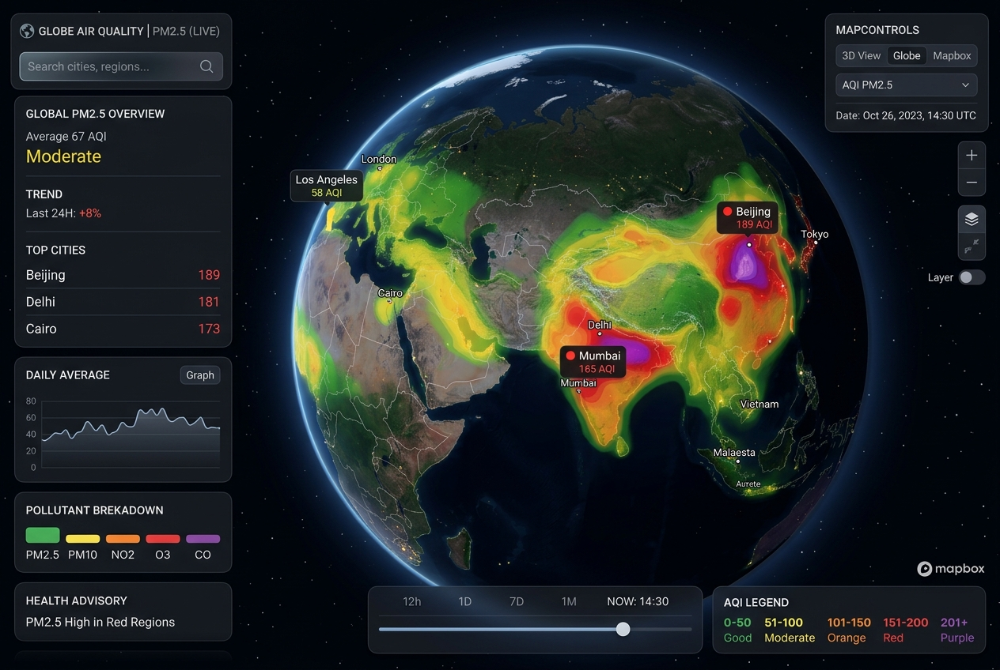

# Air Quality Map



Location-first air-quality check on a 2D Google map, powered end-to-end by
Google Maps Platform:

- **Heatmap tiles** from the [Air Quality API](https://developers.google.com/maps/documentation/air-quality)
  (`mapTypes/{type}/heatmapTiles`) rendered as an `ImageMapType` overlay:
  Universal AQI, US AQI (EPA), or PM2.5 layers with adjustable opacity.
- **Point conditions**: use browser location, click anywhere, or search a place
  to call `currentConditions:lookup` for AQI, dominant pollutants, sources,
  effects, and health recommendations.
- **Place search** via the Places `PlaceAutocompleteElement`.
- **Mobile map sheet** keeps the map interactive while conditions and controls
  stay within thumb reach.

Everything runs on a single referrer-restricted browser API key, the same
pattern as the other demos in this repo. No server proxy required.

## Setup

Create an API key with these APIs enabled:

- Maps JavaScript API
- Air Quality API
- Places API (New) (for the search box; the app degrades gracefully without it)

Restrict the key by HTTP referrer (e.g. `http://localhost:5173/*` and your
production domain).

## Run

```bash
npm install
VITE_GMP_API_KEY=your-browser-key npm run dev   # http://localhost:5173
npm run build                                    # emits dist/
```

Inside the Ryan Baumann portfolio container the app is mounted at `/aqi-map/`
(`BASE_PATH=/aqi-map/` at build time); it has no `/api/*` dependencies.
